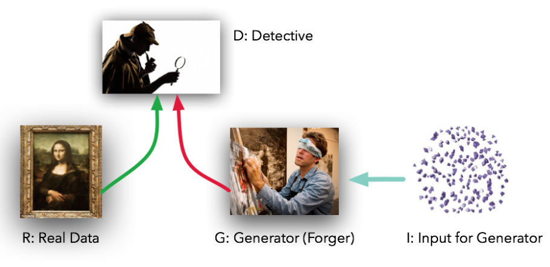

# This is [GAN]

Generative Adversarial Nets(GAN) [paper](https://arxiv.org/pdf/1406.2661.pdf)

- G : Generator, 가짜 데이터 생성기
    - 랜덤 노이즈 벡터 z를 입력받아 이미지를 만드는 업샘플링을 진행
- D : Discriminator, 판별기
    - 전달된 이미지가 실제인지 가짜인지를 판별

> 요약
> 
1. `Generator`는 기존 샘플(training, real) 분포를 파악하여 새로운 샘플(`fake`)을 `생성`함
2. `Discriminator`는 샘플이 Generator 또는 Training 중 어디에서 온건지 확률을 `평가`함 (Minimax tow-player game)
3. Genertaor가 Discriminator 분포를 `완벽`한 수준으로 복원하면 Discriminator가 Generator의 산출물(`fake`)와 Training(`real`)을 구분할 확률은 `1/2`가 됨 (가짜 진짜 구분할 확률 0.5 = 가짜와 진짜를 구분하지 못한다.)

- `x` : real 이미지
- `z` : latent code
- `G(z)` : fake 이미지
- `D(x)` : real 이미지라고 분류한 확률
- `D(G(z))` : D가 fake라고 분류한 확률

# Adversarial nets

- 첫번째 항
`real` data x를 discriminator 에 넣었을 때 나오는 결과를 log 취했을 때 얻는 기댓값

- 두번째 항
`fake` data z를 generator에 넣었을 때 나오는 결과를 discriminator에 넣었을 때 그 결과를 log(1-결과)했을 때 얻는 기댓값

- decoder 구조를 통해 latent code $`z`$에서 데이터 $`x`$ (생성된 데이터, 진짜 데이터)로 mapping

generator의 분포 $p_g$*를 x에 대해 학습시키기 위해  input noise변수에 대한 prior(사전분포)를 x에 대해* $p_z(z)$를 정의한 뒤, 그 **노이즈변수의 데이터 공간에의 `매핑(z->x)`을 $`G(Z;\theta_g)`$로 나타낸다.**
이때 G는 파라미터를 갖는 미분가능한 MLP이다. 또한 scalar 값(확률)을 출력하는 또다른 MLP인$D(X;\theta_d)$를 정의한다.$D(x)$는 입력된 샘플이 $p_g$가 아닌 실제 데이터 분포로부터 얻어졌을 확률을 계산한다.

- $z$는 단순하게 `균등 분포(Uniform Distribution)나 정규 분포(Normal Distribution)에서 무작위로 추출된 값`이다.
- `생성자`는 이렇게 `단순한 분포`를 사람 얼굴 이미지와 같은 `복잡한 분포`로 `매핑`(Mapping)하는 함수라고 볼 수 있다. 생성자 모델에 충분한 수의 매개 변수가 있다면 어떤 복잡한 분포도 근사할 수 있다는 것이 알려져 있다

> D : real 데이터와 생성 데이터에 대해 적절한 라벨을 할당하도록 하는 확률 최대화
> 

> G :  $log(1-D(G(z)))$ 최소화
> 

> D가 100%의 확률로 구분할 경우 : `D(X) = 1 , D(G(z)) = 0`
> 
- 첫번째 항 = 0 , 두번째 항 = 0
    - 이 때, D의 입장에서 V의 최댓값을 얻는다.
        
        
        

> G가 100% 확률로 속일 경우: `D(G(z)) = 1`
> 

<aside>
💡 실제분포 = 생성된(가짜) 분포

</aside>

진짜 / 가짜 분포를 구분하지 못함. 

$1-D(G(z)) = 0$이 되어서 V의 값이 $-\inf$

# Tip! **Heuristic, non-saturating game**

> G의 목적 함수 변경
> 
> 
> minimize : $log(1-D(G(z)))$ → maximize : $log(D(G(z)))$
> 

- 학습 초기(G가 형편없는 데이터를 생성할 때)에 D가 너무 잘 판별함

그래서 학습 초기 상태에 D(G(z)) = 0 인 상태가 된다.

그 때 기울기(weght)가 작기 때문에 느리게 학습된다.

> $log(D(G(z)))$를 maximize하도록 손실 함수 변경
> 

학습 초기 상태에서 D(G(z)) = 0 일때도 기울기(weight)이 크기 때문에 학습이 잘 이루어진다.

## GAN의 학습 과정

GAN의 `학습과정`을 이 그림을 통해 확인해보면, 

1. `학습초기`에는 real과 fake의 분포가 전혀 다름. D의 성능도 썩 좋지 않음 
2. D가 a 처럼 들쑥날쑥하게 확률을 판단하지 않고, 흔들리지 않고 real과 fake를 분명하게 판별해내고 있음을 확인할 수 있다. 이는 `D의 성능`이 `증가`했음을 확인할 수 있다.
3. 어느정도 D가 학습이 이루어지면, `G`는 `실제 데이터의 분포를 모사`하며 D가 구별하기 힘든 방향으로 학습을 함 
4. 이 과정의 `반복`의 결과로 real과 fake의 분포가 거의 비슷해져 구분할 수 없을 만큼 G가 학습을 하게되고 결국, `D`가 이 둘을 구분할 수 없게 되어 `확률을 1/2`로 계산하게 된다

# Theoretical Results

아래를 k번 반복 (논문에서 k = 1로 실험)

1. m개의 노이즈 샘플을 *pg*(*z*)로부터 샘플링
2. m개의 실제 데이터샘플을 *pdata*(*x*)로부터 샘플링
3. 경사상승법을 이용해 V(G,D)식 전체를 최대화하도록 discriminator 파라미터 업데이트

이후

1. m개의 노이즈 샘플을 *pg*(*z*)로부터 샘플링
2. V(G, D)에서 log(1-D(G(z)))를 최소화 하도록 generator 파라미터 업데이트

## **Global Optimality of pg=pdata**

어떤 G에서 optimal한 D가 존재한다고 생각한다면, G가 고정된 상태에서 optimal한 D는 다음과 같다.

## 증명

D와 G를 학습시키는 criterion은 다음을 최대화 하는 것인데,

위의 식을 D(x)에 대해 편미분하고 결과값을 0이라고 두면 optimal한 D는 아래와 같이 얻어짐.

이렇게 얻은 optimal D를 원래의 목적함수 식에 대입하여 생성기 G에 대한 Virtual Training Criterion C(G)를 다음과 같이 유도할 수 있다.

위의 C(G)는 generator가 최소화하고자 하는 기준이 되며, 이것의 global minimum은 오직

$p_g = p_{data}$ 일때 달성된다. 그 점에서의 C(G)값은 log4가된다.

## Convergence of Algorithm 1

G와 D가 충분한 capacity를 가지며, algorithm 1의 각 스텝에서 discriminator가 주어진 G에 대해 최적점에 도달하는게 가능함과 동시에 *pg*가 위에서 제시한 criterion을 향상시키도록 업데이트 되는 한, *pg*는 *pdata*에 수렴한다.

- Convex : 아래로 볼록
- Concave : 위로 볼록
- sup : supremum , 상한