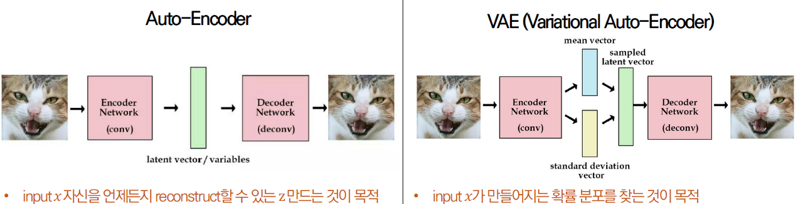

# Variational AutoEncoder

# Concept

> 변분형 오토 인코더의 목표



[Auto-Encoding Variational Bayes](https://jamiekang.github.io/2017/05/21/auto-encoding-variational-bayes/)와 [딥러닝 개념 1. VAE(Variational Auto Encoder)](https://velog.io/@ohado/%EB%94%A5%EB%9F%AC%EB%8B%9D-%EA%B0%9C%EB%85%90-1.-VAEVariational-Auto-Encoder)
를 참고하였습니다.


> 정규분포는 평균과 표준편차로 표현할 수 있다.
> 

mean vector(평균의 집합)과 standard deviation vector(표준편차의 집합)을 통해 latent vector  z(`정규분포`)를 결정할 수 있다.

사진들의 분포는 일반적이라고 여겨지는 정규분포라고 가정한다. `중심극한 정리`에 의해서 독립적인 확률변수(from 수집된 자료)는 정규분포에 가까워지는 성질이 있기 때문이다.

[*위키 백과, 정규분포*](https://ko.wikipedia.org/wiki/%EC%A0%95%EA%B7%9C_%EB%B6%84%ED%8F%AC)

결정된 공간(혹은 가중치)로 학습하며 성능이 좋은 분포를 찾아가는 과정이다.

| model | formula | distribution | role |
| --- | --- | --- | --- |
| unsupervised model | z= f(x) | p(z|x) | Encoder |
| generative model | x=g(z) | p(x|z) | Decoder |
- Encoder의 역할을 하는 NN은 Input data x 에서 잠재 변수 z를 만들고
- Decoder의 역할을 하는 NN은 잠재변수 z에서 Input data x를 복원한다.

> VAE의 기능
> 

[[Steve-Lee's Deep Insight]](https://deepinsight.tistory.com/127#elbo-%EC%A0%95%EB%A6%AC%ED%95%98%EA%B8%B0)

첫 째, 이상적인 샘플링 함수로 부터 생성한 z값으로부터 (Training DB에 있는) input data와 유사한 데이터를 생성해줘 ← Generattion

둘 째, 이상적인 sampling함수의 값이 최대한 prior값과 같도록 만들어줘  ← Condition

# [Encoder] Find Latent vector

잠재 공간 만들기

## Maximum Likelihood Estimation

분포를 찾기 위한 접근법

[공돌이의 수학정리 노트의 <최대우도법(MLE)>](https://angeloyeo.github.io/2020/07/17/MLE.html)를 참고하였습니다.

<aside>
💡 Key : 사건이 발생할 확률에서 분포를 추측하기

</aside>

- 사건 : 1, ... , n
- 사건이 발생할 확률, likelyhood  : $P(n)$


> 각 사건들이 발생할 확률의 곱을 최대화 하는 방식으로  접근
> 
- tip : 정규분포에서는 사건은 중앙에 밀집해 있다.

- 자연로그($log_e$)를 사용해서 곱을 합의 형태로 변경하여 컴퓨터의 연산에 유리한 형태로 변경


## Variational Inference

[ratsgo’s blog의 <변분추론(Variational Inference)>](https://ratsgo.github.io/generative%20model/2017/12/19/vi/)를 참고하였습니다.

Variational Inference(이하 VI)는 사후확률(posterior) 분포 $P(z|x)$를 다루기 쉬운 확률분포(정규분포) $q(z)$로 근사(approximation)하는 것이다.

> **KL divergence를 이용해 q(z)로 근사한다.**
> 

[KL divergence에 대한 자세한 내용](https://ratsgo.github.io/statistics/2017/09/22/information/)이 있습니다.

쿨백-라이블러 발산(Kullback-Leibler divergence, 이하 KLD)가 줄어드는 쪽으로 $q(z)$를 조금씩 업데이트하는 과정을 반복하면 사후확률을 잘 근사하는 $q^*(z)$를 얻게 된다.

MLE 방식으로 VAE 모델의 파라미터 추정하기 

- 변분추론을 통해 marginal log-likelihood를 최대화


노이즈를 zero-mean Gausian(표준정규분포)에서 하나 뽑아 2개의 NN ($f_u, f_\sigma$)가 산출한 평균과 분산을 더하고 곱해줘서 sampled latent vector z를 만든다. *reparameterization trick 이라고 불린다.*

> z를 직접 샘플링하는 것이 아니라, 노이즈를 샘플링하는 방식
> 

역전파를 통해 평균과 분산을 업데이트 할 수 있게 됨

랜덤분포에서 z를 샘플링 → 학습(input x에 어떤 z를 넣어야 하는 지 학습)

*x에 따라 q의 모수(평균,분산)이 바뀌게 되므로*

> Encoder 요약
> 

<aside>
💡 Endoer는 decoder에 어떤 입력 z를 넣을 지 학습한다.

</aside>


> q(z) 찾기 = ELBO를 최소화하는 방향으로 학습


ELBO에 대한 자세한 설명

[[Steve-Lee's Deep Insight]](https://deepinsight.tistory.com/127#elbo-%EC%A0%95%EB%A6%AC%ED%95%98%EA%B8%B0)


# [Decoder]

[Auto-Encoding Variational Bayes](https://jamiekang.github.io/2017/05/21/auto-encoding-variational-bayes/)를 참고하였습니다.

**Decoder는 latent variable z로 부터 x를 만들어내는 neural network**

## 문제 : 
`random` variable z → `Sampling` → `미분 불가능` → `Gradient X`

latent variable z를 넣으려면 z가 random variable이므로 sampling을 해야하는데, sampling은 미분 가능하지가 않아서 gradient를 구할 수 없습니다

## 해결방법 : *reparameterization trick*

z의 stochastic한 성질을 마치 자기 자신은 deterministic한데 외부에서 random noise ϵ이 입력되는 것처럼 바꿔 버립니다. 즉 이제 VAE는 parameter ϕ(= $\mu_z(x), \sigma_z(x)$)에 대해 end-to-end로 미분 가능한 시스템이 됩니다.

# 측정 : regularizer

- p(z)를 표현하기 위해 q(z|x)를 사용하면 얼마나 많은 정보가 손실 되는 지 측정
- q(z|x)가 p(z)에 얼마나 가까운지 측정하는 measure


MNIST 같은 image 데이터를 사용한다면, 

분포 가정

- p(x|z) : Bernoulli
- q(z|x) : Gaussian

reconstruction loss를 입출력 image간의 binary cross-entropy로 계산할 수 있습니다. Binary cross-entropy를 수식대로 계산

> 수식
> 

L(x)는 아래와 같이 쉽게 계산됩니다. 

- 주의: gradient-descent로 계산하기 위해 부호가 반대로 바뀌었습니다.

```python
def vae_loss(y_true, y_pred):
    """ Calculate loss = reconstruction loss + KL loss for each data in minibatch """
    # E[log P(X|z)]
    recon = K.sum(K.binary_crossentropy(y_pred, y_true), axis=1)
    # D_KL(Q(z|X) || P(z|X)); calculate in closed form as both dist. are Gaussian
    kl = 0.5 * K.sum(K.exp(log_sigma) + K.square(mu) - 1. - log_sigma, axis=1)

    return recon + kl
```

# Reference

[[정리노트] [AutoEncoder의 모든것] Chap4. Variational AutoEncoder란 무엇인가(feat. 자세히 알아보자)](https://deepinsight.tistory.com/127#elbo-%EC%A0%95%EB%A6%AC%ED%95%98%EA%B8%B0)

[Auto-Encoding Variational Bayes](https://jamiekang.github.io/2017/05/21/auto-encoding-variational-bayes/)

[Variational AutoEncoder](https://ratsgo.github.io/generative%20model/2018/01/27/VAE/)